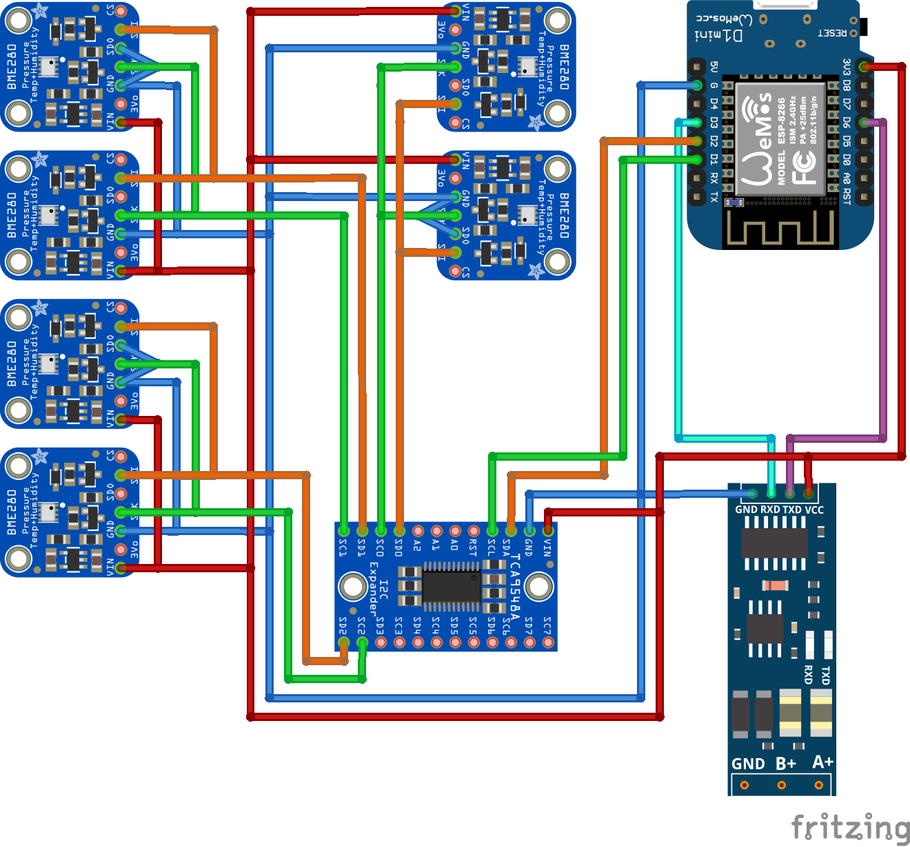
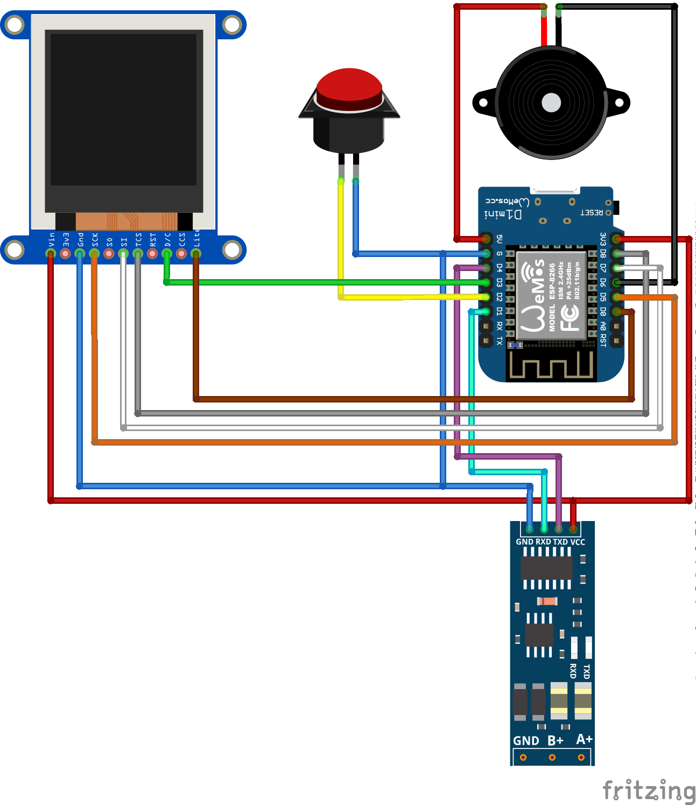

# Humidity Monitoring Solution

The intention of the project is to monitor a ceiling cavity for critical humidity. This ceiling cavity is far away from any wlan hotspot. For that reason the system is divided in two units connected with RS485. The communication protocol used on top of RS485 is [PJON](https://www.pjon.org/). The sensor unit has a connection to 3 sensor pairs through I2C bus. The control unit has a buzzer, a display and a button. If humidity is to high the buzzer is activated until a normal value is reached again. The button deactivates the buzzer in the case of an error or enables or disables the display. The dispalay is automatically disabled after 10 minutes inactivity. For historical data recording and alerting the sensor data is submitted to [ubidots](https://ubidots.com/) through a MQTT connection connected over a wlan access point.

## Wiring

Sensor unit and control unit are connect through RS485 (A+, B+, GND connected with a cat. 5 patch cable wires).

### Sensor Unit

__Hardware Components__
* [Wemos D1 mini](https://www.wemos.cc/en/latest/d1/d1_mini.html)
* [TCA9548A 8-Channel I2C Switch](http://www.ti.com/lit/ds/symlink/tca9548a.pdf)
* [BME280 Pressure Module](https://startingelectronics.org/pinout/GY-BMP280-pressure-sensor-module/) 
  * Tutorials: [[1](https://startingelectronics.org/tutorials/arduino/modules/pressure-sensor/)] [[2](https://randomnerdtutorials.com/esp8266-bme280-arduino-ide/)] [[3](https://www.bluedot.space/tutorials/connect-two-bme280-on-i2c-bus/)] [[4](http://cactus.io/hookups/sensors/barometric/bme280/hookup-arduino-to-multiple-bme280-barometric-pressure-sensors)]
* [TTL RS485 Adapter](https://www.makershop.de/module/kommunikation-module/ttl-rs485-adapter/)
  * [Alternative](https://www.welectron.com/Waveshare-4777-RS485-Board-33V)

### Control Unit

__Hardware Components__
* [WEMOS D1 mini](https://www.wemos.cc/en/latest/d1/d1_mini.html)
* [WEMOS TFT 1.4 Shield](https://www.wemos.cc/en/latest/d1_mini_shiled/tft_1_4.html)
* [WEMOS Buzzer Shield](https://www.wemos.cc/en/latest/d1_mini_shiled/buzzer.html)
* [TTL RS485 Adapter](https://www.makershop.de/module/kommunikation-module/ttl-rs485-adapter/)

## Libraries
* WEMOS D1 mini (ESP8266)
  * [5V tolerant?](https://www.ba0sh1.com/blog/2016/08/03/is-esp8266-io-really-5v-tolerant/)
  * Tutorials/Guides:
    * PINs: [[1](https://randomnerdtutorials.com/esp8266-pinout-reference-gpios/)] [[2](http://esp8266-server.de/wemos.html#Pinbelegung)]
    * [Safe Restart](https://github.com/esp8266/Arduino/issues/1722)
    * [WiFi](https://arduino-esp8266.readthedocs.io/en/latest/esp8266wifi/readme.html)
        * WPS [[1](https://www.az-delivery.de/blogs/azdelivery-blog-fur-arduino-und-raspberry-pi/wps-mit-dem-esp8266)] [[2](https://gist.github.com/copa2/fcc718c6549721c210d614a325271389)]
        * [MQTT Client](https://github.com/knolleary/pubsubclient)
        * [Cloud Storage Ubidots](https://ubidots.com/docs/hw/#mqtt)
    * ([DeepSleep](https://randomnerdtutorials.com/esp8266-deep-sleep-with-arduino-ide/))
* BME280 through I2C
    * [BME](https://github.com/finitespace/BME280)
    * [I2C](https://github.com/pasko-zh/brzo_i2c) (Fast Software BitBang written in assembly!)
        * [Interesting infos about I2C](https://www.i2c-bus.org/i2c-primer/analysing-obscure-problems/blocked-bus/)
* TFT
  * [Adafruit-ST7735-Library](https://github.com/adafruit/Adafruit-ST7735-Library/)
  * [U8g2_for_Adafruit_GFX](https://github.com/olikraus/U8g2_for_Adafruit_GFX)
    * [generate fonts](https://github.com/olikraus/u8g2/blob/master/doc/faq.txt#L179)
    * [generate icons](https://github.com/olikraus/u8g2/blob/master/tools/font/png2bdf/test/do_iconic.sh)
  * Examples
    * [Shield](https://github.com/wemos/D1_mini_Examples/tree/master/examples/04.Shields/TFT_1.4_Shield)
    * [Generate Colors](http://www.barth-dev.de/online/rgb565-color-picker/)
* RS485
  * no special library needed
  * Tutorials: [[1](https://maker.pro/arduino/tutorial/creating-long-distance-serial-communication-using-an-arduino-and-an-rs-485-module)] [[2](https://create.arduino.cc/projecthub/philippedc/arduino-esp8266-rs485-modbus-anemometer-45f1d8)] [[3](https://www.hackster.io/philippedc/arduino-esp8266-rs485-modbus-anemometer-45f1d8)] [[4](https://microcontrollerelectronics.com/sn75176-rs485-communications-between-two-arduinos/)] [[5](https://arduinoinfo.mywikis.net/wiki/SoftwareSerialRS485Example)]
  * [PJON](https://www.pjon.org) ([Github](https://github.com/gioblu/PJON)) as network protocol
    * Examples: [[1](https://github.com/gioblu/PJON/tree/master/src/strategies/ThroughSerialAsync)] [[2](https://www.pjon.org/data-reception.php)]
* Button
    * no special library needed
    * Tutorial: [[1](https://hikro.de/arduino-taster-als-schalter-programmieren)] [[2](https://www.arduino.cc/reference/en/language/functions/external-interrupts/attachinterrupt/)]

## Other sources
* [Fritzing parts](https://github.com/Warlib1975/Fritzing-parts)